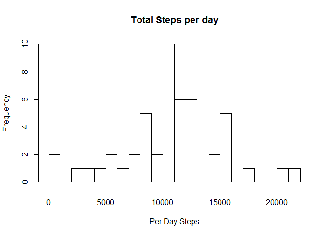
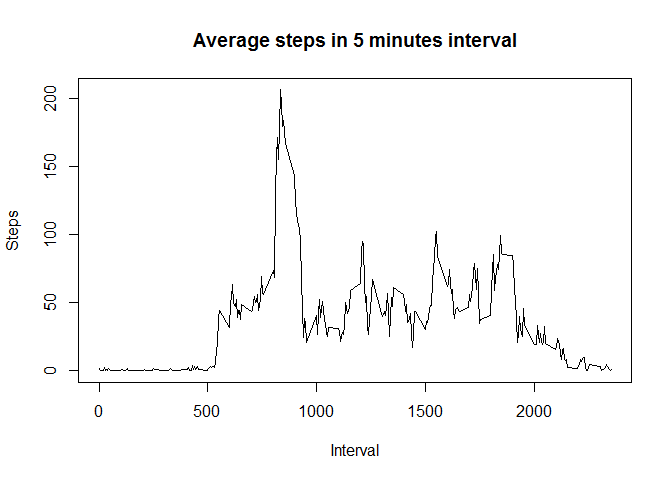
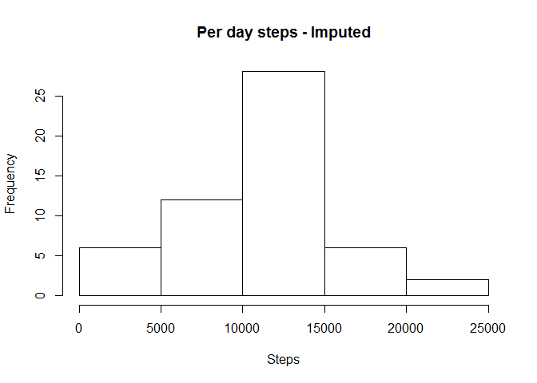
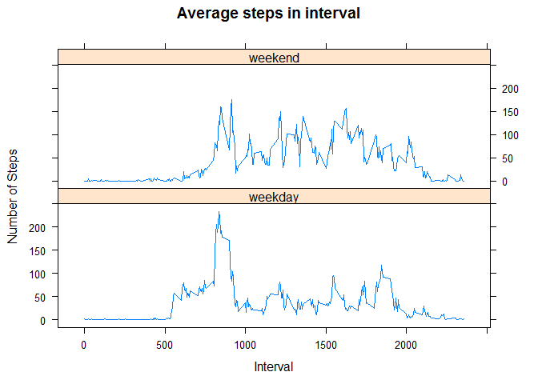

Reading the dataset
-------------------

    knitr::opts_chunk$set(echo = TRUE)
    suppressWarnings(library(lattice))

    if(!file.exists("getdata-projectfiles-UCI HAR Dataset.zip")) {
           temp <- tempfile()
          download.file("http://d396qusza40orc.cloudfront.net/repdata%2Fdata%2Factivity.zip",temp)
            unzip(temp)
          unlink(temp)
    }
    smpdata <- read.csv("activity.csv")

Count number of steps each day, draw histogram, calculate mean and median
-------------------------------------------------------------------------

    perdaysteps <- aggregate(steps~date, data = smpdata, na.rm=TRUE, sum)

    hist(perdaysteps$steps, breaks= 20, xlab = "Per Day Steps", main = "Total Steps per day")

<!-- -->

    smpmean <- mean(smpdata$steps, na.rm=TRUE)
    print(paste("The mean step each day- ", smpmean))

    ## [1] "The mean step each day-  37.3825995807128"

    smpmedian <- median(smpdata$steps, na.rm = TRUE)
    print(paste("The median of step each day- ", smpmedian))

    ## [1] "The median of step each day-  0"

Time series plot for steps at 5 minute interval and interval in which maximum steps taken.
------------------------------------------------------------------------------------------

    avgsteps <- aggregate(steps~interval, data = smpdata, na.rm=TRUE, mean)
    plot(avgsteps$interval, avgsteps$steps, type="l", xlab="Interval", ylab = "Steps", main="Average steps in 5 minutes interval")

<!-- -->

    maxstpintv <- avgsteps[avgsteps$steps==max(avgsteps$steps),]
    print(paste("The 5 minute interval with max steps is -", maxstpintv))

    ## [1] "The 5 minute interval with max steps is - 835"             
    ## [2] "The 5 minute interval with max steps is - 206.169811320755"

Total missing values in data set, mean and median after imputation of missing values
------------------------------------------------------------------------------------

Imputation - For imputation of missing values, taken average of steps for each day and replaced with missing value. Replaced first day missing value with 0 since all are missing.
----------------------------------------------------------------------------------------------------------------------------------------------------------------------------------

    print(paste("Total missing values - ",sum(is.na(smpdata$steps))))

    ## [1] "Total missing values -  2304"

    avgdatestp <- aggregate(steps ~ date, data= smpdata, na.rm=TRUE, mean)

    imputedata <- transform(smpdata, steps = ifelse(is.na(smpdata$steps), avgdatestp$steps[match(smpdata$date, avgdatestp$date)], smpdata$steps))
    imputedata[as.character(imputedata$date) == "2012-10-01",1] <- 0

    perdaysteps_new <- aggregate(steps ~ date, data = imputedata, sum)

    hist(perdaysteps_new$steps, xlab = "Steps", main="Per day steps - Imputed")

<!-- -->

    smpmean_new <- mean(imputedata$steps, na.rm=TRUE)
    print(paste("The mean step each day- ", smpmean_new))

    ## [1] "The mean step each day-  36.690329218107"

    smpmedian <- median(smpdata$steps, na.rm = TRUE)
    print(paste("The median of step each day- ", smpmedian))

    ## [1] "The median of step each day-  0"

The mean of the imputed data has reduced as compared to the data with
NA's. But the median is same as 0.

The average number of steps taken, averaged across all weekday days or weekend days
-----------------------------------------------------------------------------------

    smpdata$Day <- weekdays(as.Date(smpdata$date))
    smpdata$Day<- as.factor(ifelse(smpdata$Day == "Saturday" |smpdata$Day == "Sunday", "weekend", "weekday"))

    avgstepsweekday <- aggregate(steps~interval + Day, data = smpdata, na.rm=TRUE, mean)

    xyplot(avgstepsweekday$steps~avgstepsweekday$interval |avgstepsweekday$Day , layout=c(1,2), type="l", xlab="Interval", ylab ="Number of Steps", main="Average steps in interval" )

<!-- -->
